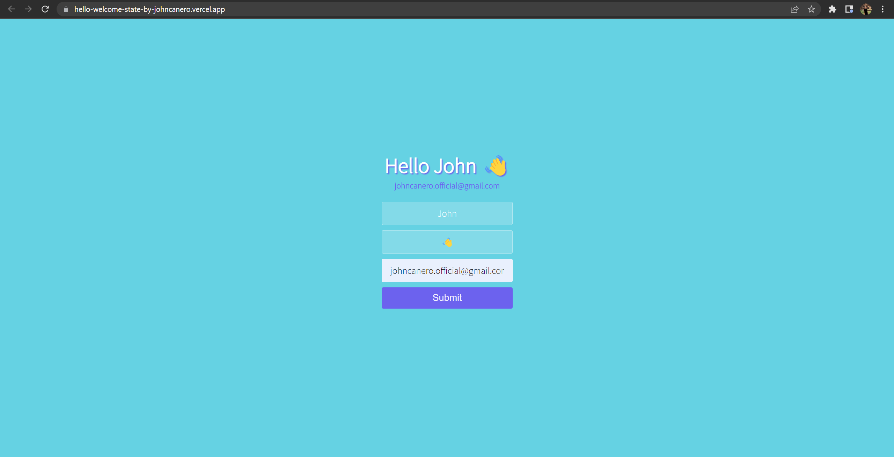
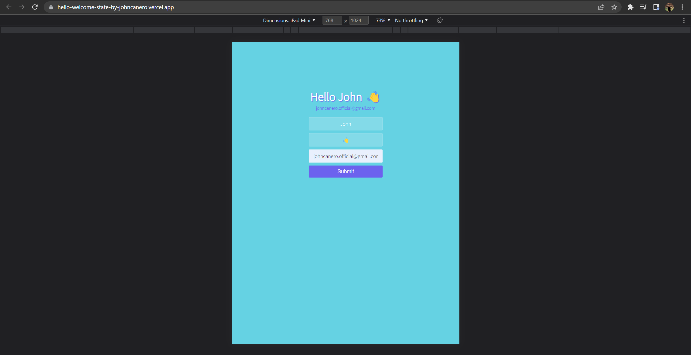
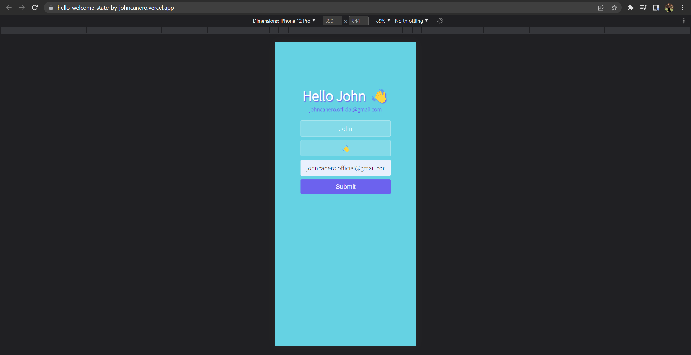
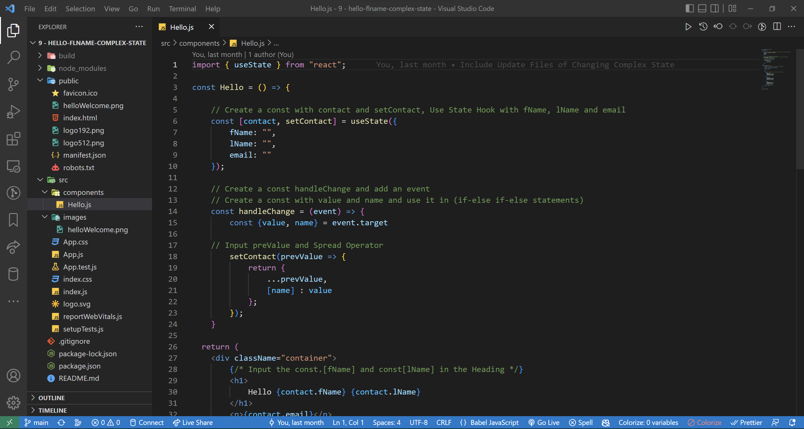

<!-- markdownlint-configure-file {
  "MD013": {
    "code_blocks": false,
    "tables": false
  },
  "MD033": false,
  "MD041": false
} -->

  

# Hello Welcome

This is the Hello Welcome Project on Udemy - Web Development Bootcamp 2022

It is made with React JS utilizing the State Hook in React. Welcome! 👐

## Website

🖥️ [https://hello-welcome-state-by-johncanero.vercel.app/]

✍️ Project by John Cañero

## Responsive Design

🪟: [Desktop - Tablet - Mobile]

